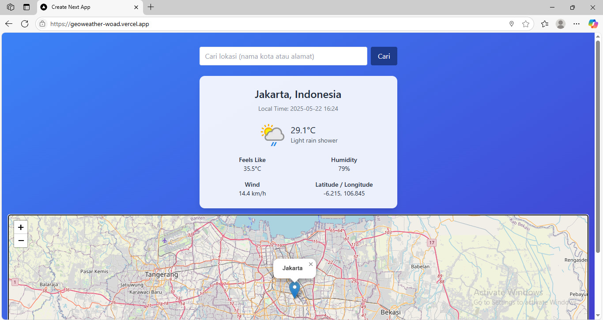

# 🌤️ GeoWeather App

**GeoWeather** adalah aplikasi web yang menampilkan **cuaca saat ini** berdasarkan lokasi pengguna secara otomatis menggunakan **Geolocation API**, serta memungkinkan pencarian lokasi manual. Data cuaca diambil dari **WeatherAPI**, dan lokasi divisualisasikan melalui **Leaflet.js + OpenStreetMap**.

Dibangun menggunakan [Next.js App Router](https://nextjs.org/docs/app) dan Tailwind CSS, serta **siap deploy di Vercel**.

---

## 🚀 Demo Live

🌐 [https://geoweather-woad.vercel.app/](https://geoweather-woad.vercel.app/)

---

## ✨ Fitur Utama

- 🌍 Deteksi lokasi otomatis via **Geolocation API**
- 🔍 Pencarian lokasi manual (nama kota atau negara)
- 🗺️ Peta lokasi menggunakan **Leaflet.js + OpenStreetMap**
- 🌤️ Cuaca real-time:
  - Suhu, kondisi langit, kecepatan angin, kelembapan
  - Ikon cuaca & waktu lokal
- 🎯 Menampilkan koordinat Latitude & Longitude
- ⚡ Notifikasi dinamis (custom toast)
- 📱 Desain UI responsif dan ringan

---

## 🛠️ Tech Stack

- **Framework**: [Next.js 14](https://nextjs.org/) (App Router)
- **Styling**: [Tailwind CSS](https://tailwindcss.com/)
- **Peta**: [Leaflet.js](https://leafletjs.com/) + [OpenStreetMap](https://www.openstreetmap.org/)
- **Cuaca**: [WeatherAPI.com](https://www.weatherapi.com/)
- **Deployment**: [Vercel](https://vercel.com/)

---

## 📦 Instalasi Lokal

### 1. Clone Repository
```bash
git clone https://github.com/azazasfaliyasa/geoweather.git
cd geoweather
```

### 2. Install Dependencies
```bash
npm install
# atau
yarn install
```

### 3. Setup Environment Variables
Buat file `.env.local` di root project dan isi dengan:
```env
NEXT_PUBLIC_WEATHER_API_KEY=your_weatherapi_key
```

> 💡 Dapatkan API key gratis di [https://www.weatherapi.com/](https://www.weatherapi.com/)

### 4. Jalankan Development Server
```bash
npm run dev
```

Buka [http://localhost:3000](http://localhost:3000) di browser.

---

## 🚀 Deploy ke Vercel

Aplikasi siap langsung di-deploy ke Vercel:

1. Push project ke GitHub
2. Buka [https://vercel.com/new](https://vercel.com/new)
3. Import repository kamu
4. Tambahkan variabel environment:
   - `NEXT_PUBLIC_WEATHER_API_KEY`
5. Klik **Deploy**

---

## 📸 Preview



---

## 🧑‍💻 Kontributor

Made with ❤️ by [Azaz Asfali Yasa](https://github.com/azazasfaliyasa)

---

## 📄 License

**MIT License** — Bebas digunakan dan dimodifikasi untuk keperluan pribadi maupun komersial.